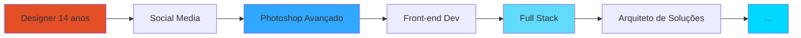

<div align="center">

<!-- HERO VISUAL IDENTITY -->


<br/>

<!-- DYNAMIC TYPING EFFECT SIMULATION -->
```ascii
┌─────────────────────────────────────────────────────────────┐
│  > Compilando visão criativa com lógica de engenharia...   │
│  > Carregando: UI/UX + React + Node.js + Inovação          │
│  > Status: [████████████████████████] 100% - PRONTO        │
└─────────────────────────────────────────────────────────────┘
```

<!-- <h1>
  
</h1> -->

### 🎯 **Designer que programa. Desenvolvedor que desenha.**
> *De pixels no Photoshop aos pixels no código — transformando design em engenharia desde 2017*

---

</div>

## 🧬 DNA Técnico × Criativo

```javascript
const ryan = {
  localização: "Aracaju, SE 🌴",
  idade: 22,
  empresa: "Savai Creative",
  
  filosofia: "Código limpo não é apenas funcional — é elegante",
  
  jornada: {
    2017: "Designer Gráfico → descobrindo a estética",
    2020: "Social Media → entendendo pessoas",
    2022: "Front-end → traduzindo design em código",
    2024: "Full Stack → arquitetando sistemas completos",
    2025: "ADS @ Uninassau + DevClub → evolução constante"
  },
  
  mindset: [
    "📐 Design thinking aplicado ao código",
    "🏗️ Arquitetura antes da implementação", 
    "♿ Acessibilidade como padrão, não extra",
    "📈 Performance é experiência do usuário",
    "🎓 Documentação é amor ao próximo dev"
  ]
}
```

<div align="center">

## 🛠️ Arsenal de Desenvolvimento

### **Frontend — Onde Design Encontra Código**


### **Backend — A Engenharia por Trás da Interface**


### **Design & UX — Minha Origem**


</div>

---

## 💡 O Que Eu Construo

<table>
<tr>
<td width="50%">

### 🎨 **Front-end com Alma**
- Interfaces que respiram UX
- Animações que contam histórias
- Responsividade pixel-perfect
- Acessibilidade WCAG 2.1
- Performance otimizada (Lighthouse 90+)

</td>
<td width="50%">

### ⚙️ **Back-end com Propósito**
- APIs RESTful escaláveis
- Autenticação JWT + OAuth
- WebSockets para real-time
- Arquitetura MVC limpa
- Testes unitários e integração

</td>
</tr>
<tr>
<td width="50%">

### 🎯 **UI/UX com Dados**
- Design Systems completos
- Prototipagem de alta fidelidade
- User Research & Testes A/B
- Wireframes & User Flows
- Microinterações que encantam

</td>
<td width="50%">

### 🚀 **Produtos Completos**
- Do Figma ao Deploy
- CRUDs inteligentes
- Dashboards administrativos
- Integrações com APIs
- Documentação técnica clara

</td>
</tr>
</table>

---

<div align="center">

## 🌊 Evolução Contínua



### 📊 Estatísticas de Aprendizado

**2024-2025**: DevClub + Projetos Reais + ADS  
**Foco Atual**: Arquitetura de Software + System Design + Padrões Avançados

</div>

---

## 🎯 Diferenciais Competitivos

> **Não sou apenas mais um dev React ou designer no Figma.**

| 🎨 Background Criativo | 🔧 Mentalidade de Engenheiro |
|:---:|:---:|
| 8 anos moldando estética | Código como obra de arte |
| Olhar treinado para UI/UX | Estrutura antes da execução |
| Entendo o **porquê** visual | Explico o **porquê** técnico |

```typescript
interface MeuDiferencial {
  criatividade: "Photoshop desde 2017";
  engenharia: "Full Stack desde 2022";
  resultado: "Produtos que funcionam E encantam";
  mindset: "Não faço telas bonitas. Construo soluções sustentáveis.";
}

// De "iniciante com medo" → profissional que entende decisões técnicas
```

---

<div align="center">

## 📡 Canais de Comunicação

<a href="https://api.whatsapp.com/send?phone=5579988318550&text=Ol%C3%A1%20Ryan!%20Vi%20seu%20perfil%20no%20GitHub%20e%20gostaria%20de%20conversar%20sobre">
  
</a>
<a href="https://www.instagram.com/ryanofc_rpm/">
  
</a>
<a href="https://www.linkedin.com/in/seu-linkedin">
  
</a>
<a href="mailto:seu-email@example.com">
  
</a>

---

### 💬 Vamos Construir Algo Incrível Juntos?

**Busco:** Projetos desafiadores • Colaborações criativas • Time que valoriza qualidade

**Ofereço:** Visão de produto • Código limpo • Design funcional • Comprometimento real

---

<br/>

```ascii
╔═══════════════════════════════════════════════════════════════╗
║                                                               ║
║  "Código bem escrito é poesia para máquinas,                 ║
║   mas também deve ser prosa clara para humanos."             ║
║                                                               ║
║                                          — Ryan Rodrigues    ║
║                                                               ║
╚═══════════════════════════════════════════════════════════════╝
```

<sub>💻 Desenvolvido com ☕ café, 🎨 criatividade e 🧠 lógica em Aracaju, SE</sub>

---

[](https://github.com/seu-username)

</div>
